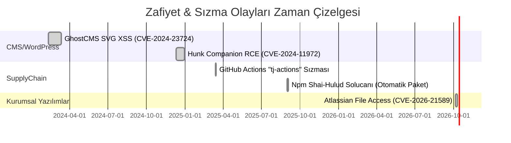

# Yönetici Özeti  
2024–2026 döneminde web uygulama güvenliğinde yüksek riskli açıklar ve sızıntılar ciddi artış gösterdi. Bu raporda, Ghost CMS’den WordPress ekosistemine, API/kimlik doğrulamadan bulut konfigürasyon hatalarına kadar birçok zafiyet incelendi. Öne çıkan bulgular: **CMS eklentilerindeki zayıflıklar (toplam WP açıklarının %96’sı eklentilerde)**; **SVG XSS gibi sıradışı zincir saldırılar**; **CI/CD tedarik zinciri saldırılarının yükselişi** (GitHub Actions, npm kancalar vb.); ve **bulut ortamı yanlış yapılandırmalarının yaygınlığı**. Örneğin Atlassian, Denodo Scheduler ve WordPress eklentilerinde çok kritik açıklar bulundu (CVE-2026-21589, CVE-2025-26147, CVE-2024-11972, CVE-2024-23724 vs.). Bu açıklar genellikle kolayca istismar edilebiliyor; bazılarında kamuya PoC kodu yayınlandı. Tespit ve hafifletme için inceleme ipuçları aşağıda detaylı anlatılmıştır.  

## Öncelikli Zafiyetler ve İstismar Zincirleri  
1. **Ghost CMS – SVG’den Admin Ele Geçirme (CVE-2024-23724):** Ghost (Node.js) 5.76.0 öncesi versiyonlarda sahte `.svg` profil resim yükleme yolu ile saklı XSS açığı bulunmuştur. Düşük seviyeli *contributor* kullanıcısı zararlı SVG’ye gömülü JavaScript ile yöneticinin tarayıcısında çalışacak kodu enjekte eder. Bu kod arka planda `http://127.0.0.1:3001/ghost/api/admin/` uç noktasına istek yaparak yeni owner hesabı oluşturur veya şifre değiştirir. Yani basit bir resim upload ile admin ele geçirilebilir. İstismar ön gereksinimi: contributor yetkisi. PoC yayımlandı (Rhino SecLabs GitHub). **Zarar:** Tam erişim (PRIVILEGE ESCALATION, CVSS 9.0 Kritik). **Detay:** XSS içerikli SVG’ler sunucuda kullanıcı dizininde saklanır ve sayfa görüntülenirken çalışır. Çözüm olarak Ghost 5.76.0 güncellemesi gerekir; yama DOMPurify ile SVG taraması ekler (Pull #19646). Kalıcı tespit için SVG yüklemelerini inceleyen imza veya CSP önerilir. *Pentest kontrolleri:* SVG yükleme fonksiyonuna script etiketi engellemesi koyup admin sayfalarında dinamik içerik oluşturmayı simüle ederek test edin. 

   ```mermaid
   sequenceDiagram
       contributor->>Ghost: SVG profil yükler (zararlı script içerir)
       Ghost->>ImageStore: SVG dosyası kaydedildi
       Admin->>Ghost: Contributor profil sayfasını görüntüler
       activate Ghost
       Ghost->>AdminBrowser: Zararlı script çalıştırılır
       AdminBrowser->>GhostAPI: Şifre sıfırla / yeni owner isteği (CSRF ile)
       GhostAPI->>Database: Yeni admin kullanıcısı oluşturuldu
       deactivate Ghost
   ``` 

2. **Hunk Companion – Eklenti Zincirleme RCE (CVE-2024-11972):** TemaHunk tarafından geliştirilen Hunk Companion eklentisinin ≤1.8.5 sürümünde, yetkilendirme eksikliği sayesinde saldırganlar **uzaktan kod yürütme** sağlayan başka bir eklentiyi otomatik kurabiliyordu. Örneğin WPScan ekibi, bu açığı keşfedip güncelledi: saldırgan Hunk Companion’ı kullanarak düğümden yeni bir eklenti (ör. CVE-2024-50498 ile bilinen bir RCE açığı içeren *WP Query Console*) indiriyor ve siteye yükleyebiliyor. Yani Hunk Companion, saldırganlara sitenin kontrolünü ele geçirme zinciri sundu. Etkilenen sürümler ≤1.8.5, puan 9.8 (kritik). PoC ve yama (1.9.0) yayınlandı. *Pentest:* Hunk Companion’ın kurulu olduğu sitelerde `/wp-json` veya `/wp-admin/admin-ajax.php` gibi REST API uç noktalarını inceleyerek yetki kontrollerini test edin. Manuel olarak eski sürümü kurup Wordfence veya Burp Suite ile plugin yükleme fonksiyonunu deneyin. 

3. **Atlassian Data Center – Yetkisiz Dosya Erişim (CVE-2026-21589):** Ekim 2026’da yayınlanan bir kitaplık açığı, Atlassian’ın Confluence, Jira, Bitbucket, Crowd vb. sunucu sürümlerini etkiledi. Bu sayfalardan dosya okuma zafiyeti ile saldırgan, web uygulama kök dizinindeki dosyalara erişebiliyor. Atlassian’a göre saldırı için dosya adı/pat bulunması gerekiyor ama PoC hemen yayımlanıp suistimal edildi. Örneğin, Crowd kimliği ile entegre Jira’da `crowd.properties` dosyası okunarak açık teksifre Crowd kimlik bilgileri ele geçirilebiliyor; böylece yeni admin oluşturmak “oyunu bitiriyor”. CVSS 9.3 (Kritik) verilmiştir. *Çözüm:* Tüm Data Center bileşenleri acilen güncellenmeli. Ağ erişimi sınırlanmalı. *Pentest:* Atlassian URL’lerinden dosya yolu enjekte ederek `/.ini`, `/.properties` gibi yapılandırma dosyalarını isteyin. Crowd/Jira entegrasyonu varsa kimlik bilgileri varlığına bakın. 

4. **Denodo Scheduler – Kimlikli Path Traversal/RCE (CVE-2025-26147):** Denodo veritabanı platformunun “Scheduler” bileşeni (v8.0.202309140 öncesi) Kerberos yapılandırması için keytab dosyası yükleme işlevinde yol atlama açığı bulunmuştur. Yönetici kimliğiyle isteğe özel `filename="../../../../opt/denodo/malicious.txt"` gibi gönderilince dosya sunucunun istenilen yerine yazılıyor (tarihle). Bu yetkiyle kötü niyetli dosyalar yerleştirildikten sonra RCE elde etmek mümkün oluyor. Açık yönetici yetkisi gerektiriyor (CWE-22). PoC blog yazısında detaylı anlatılmış. Düzeltme Denodo 8.0 güncellemesiyle yapılmıştır. *Test:* `keytab` yükleme formunu catch edip `../../../` payloadları ile tarama yapın; yazılan dosyaların içeriklerini kontrol edin. 

## Nadir/Özel Açık Sınıfları  
- **SVG/XSS kombinasyonları:** Yukarıdaki Ghost örneği gibi, “SVG içi script” açığı nadir ancak etkili bir yöntem. Benzer biçimde WordPress eklentileri ya da diğer CMS’lerde SVG içindeki `<script>` yürütme zafiyetlerine dikkat edilmeli.  
- **Tedarik Zinciri Saldırıları:** 2025–2026’da GitHub Actions ve npm üzerinden yeni saldırı zincirleri görüldü. Örneğin Mart 2025’te (tj-actions), Eylül 2025’te Shai-Hulud npm solucanı ile otomatik kötü amaçlı paket yayıldı. Bu saldırılar doğrudan yazılım zafiyeti değil, CI/CD sürecindeki güven açığıdır (malicious commit ile yüzlerce depo ele geçirildi). Tespit etmek için değiştirilen workflowlar, yeni token kullanımları izlenmeli.  
- **Karmaşık Yetki Bypass:** Örneğin OpenID/OAuth/Open Redirect hataları, Zynnikigibi yeni kimlik doğrulama hataları veya “send password link” atakları 2024–25’te arttı. Spesifik CVE olarak  yakalamak zor olsa da, login ve oturum yönetimi zafiyetlerinin payı %14 civarındadır (WordPress örneği).  
- **SQL/SSRF gibi klasik saldırıların yeni varyantları:** Veri tabanı enjeksiyonları (SQLi/NoSQLi) ve SSRF yüzdesi düşük kalsa da (WordPress’te SSRF %nadir), özellikle Grafana/Elastic gibi modern API bileşenlerinde görülen yeni maddeler (örn. JWT sınırı aşımlar, regex DoS) takip edilmeli. 

## Zaman Çizelgesi ve Trendler (2024–2026)  
Aşağıdaki mermaid grafikleriyle hem tekil olayları hem de yıllık trendleri özetliyoruz:



Web ekosisteminde WordPress gibi popüler platformlar üzerinde açıklar hızla çoğalıyor. Örneğin Patchstack’a göre 2024’te **7.966** yeni WordPress açığı tespit edildi ki bunların %96’sı eklenti/k tema kaynaklı. Yüzde 47.7’si XSS, %14.2’si yetki kontrolleri, %11.4’ü CSRF idi. Buna rağmen *yama hızları* düşük: açıklanan WP açılarının %33’ü yamalanmadan duyurulmuş. Bu da “abandoned” (bakılmayan) eklentilerin milyonlarca sitede tehlike oluşturduğu anlamına geliyor.  

**Bulut ortamı** da hata kaynıyor: Elastic’in 2024 raporu, Microsoft Azure’da %47, AWS’de %30 gibi büyük bir oranla yapılandırma eksikliği tespit etti. Örneğin 2024’te AWS S3’lerde doğrulama (MFA) eksikliği veya genel erişim hatası sık görüldü. Bu tür bulut zafiyetleri genelde CVE ile değil “kimlik bilgisi sızıntısı” olarak raporlandığından, sayı vermek zor ama saldırganların bulut erişimlerini hedef aldığı açıkça görülüyor.

Aşağıdaki tabloda öncelik verdiğimiz açıkları özetledik:

| CVE / Zafiyet                        | Ürün (Sürüm)                  | Etki (CWE)                   | Önkoşul / Erişim  | CVSS  | PoC/Exploit           | Önlem/Yama                     |
|:-------------------------------------|:------------------------------|:-----------------------------|:-----------------:|:-----:|:---------------------:|:-------------------------------|
| **Ghost CMS SVG XSS** (CVE-2024-23724) | Ghost ≤5.76.0                 | XSS → Yönetici ele geçirme (CWE-79) | Kayıtlı *contributor* | 9.0 Kritik | PoC (Rhino Labs); yamalı PR var | Ghost’u 5.76.1+ yap; SVG yüklemeyi engelle / CSP uygula |
| **Hunk Companion** (CVE-2024-11972)   | WordPress Eklenti ≤1.8.5      | Yetkisiz eklenti yükleme (CWE-285) | Herkese açık API   | 9.8 Kritik | PoC var; aktif istismar edildi | 1.9.0 sürümüne güncelle; API erişimini kısıtla  |
| **Atlassian File Access** (CVE-2026-21589) | Atlassian Data Center       | Dosya okuma (path traversal) (CWE-22) | İnternete açık uygulama | 9.3 Kritik | PoC yayımlandı; saldırı başladı | Güncellemeleri uygula; firewall ile dosya erişimi sınırla |
| **Denodo Scheduler** (CVE-2025-26147) | Denodo 8.0 Scheduler          | Path traverse (CWE-22) → RCE       | Yönetici girişi      | Yaklaşık 8.x Yüksek | Ayrıntılı teknik yazı | denodo-v80-update-20240307 güncellemesi ile düzeltildi |

## Sonuç ve Öneriler  
2024–2026’da **web uygulamalarında** aralarında az duyulmuş tekniklerin de bulunduğu birçok kritik zafiyet keşfedildi. **Temel ders:** Yazılım tedarik zincirine (CI/CD eylemleri, üçüncü taraf paketler) ve son kullanıcı yüklemelerine (örneğin SVG’ler) güvenmek büyük risk oluşturabilir. Tespit için dinamik testlere, otomatik tarayıcılara ve yapılan yamaların takibine özen gösterilmeli. Ayrıca bulut platform ayarları düzenli denetlenmeli (public bucket taraması, IAM roller gözden geçirme, MFA kullanımı gibi). 

**Pentest öncelikleri:** Yüksek profilli ürünleri hedef alan zafiyetlere odaklanın (Ghost, Atlassian, Denodo, WP eklentileri vs.). Örneğin *posta kutusu nükleüsü* gibi sıradan test araçlarının geçmediği SVG yükleme kontrolü, path traversal denemeleri, GitHub Actions/CI token sızıntısı senaryolarını ekleyin. Her bir açık için PoC kodları incelenmeli ve etkilerini göstermeyen güvenli test adımları belirlenmelidir. Kaynaklarda belirtilen resmi bildirimler ve pencereler takip edilmeli (CVE/NVD/MITRE, vendor bültenleri, exploit DB/GitHub). 

**Takip ve Önlem:** Tabloda kıyaslanan açılara benzer yüksek riskli güvenlik açıklarında, yamalar mümkün olan en kısa sürede uygulanmalı ve ağ katmanında ek filtrelemeler (CSP, WAF kuralları) eklenmelidir. Ayrıca davranışsal izleme (örneğin anormal localhost istekleri, alışılmadık eklenti yüklemeleri) ile sıfır-gün sızıntıları yakalamak mümkün olabilir. Güvenlik takımı olarak **güncel istihbaratları** sürekli takip etmek ve risk puanlamasına göre kaynak ayırmak en iyi uygulamadır. 

**Kaynaklar:** CVE/NVD ve MITRE veritabanlarından güncel bilgiler, vendor güvenlik duyuruları, araştırma blogları ve exploit kaynakları kullanılmıştır. Detaylı bilgi için ilgili CVE kayıtları ve üretici yamaları incelenebilir. 

